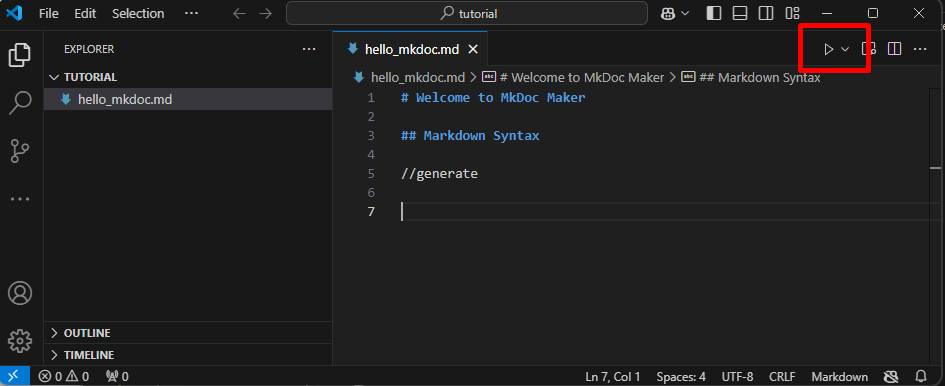
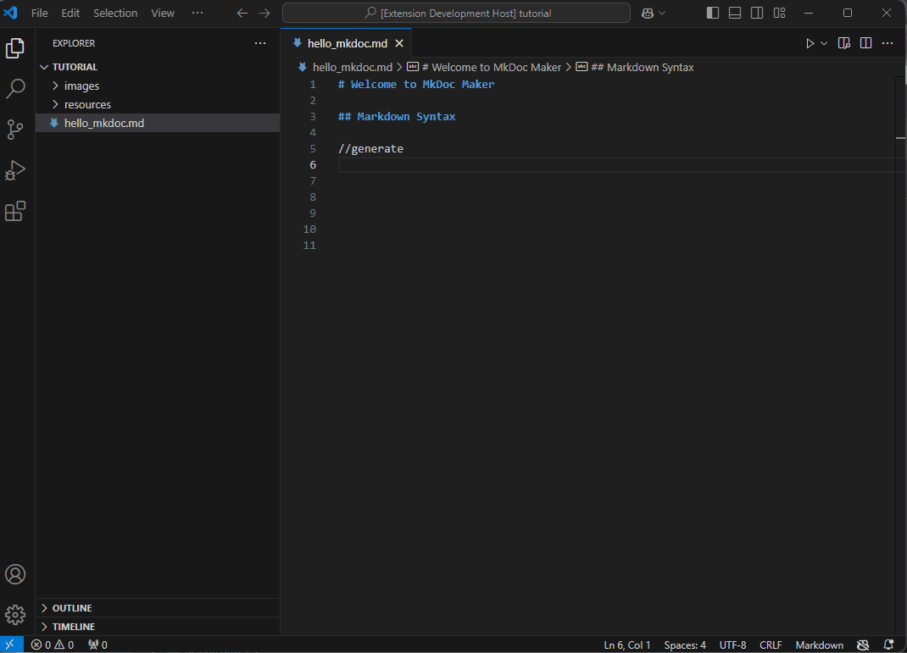
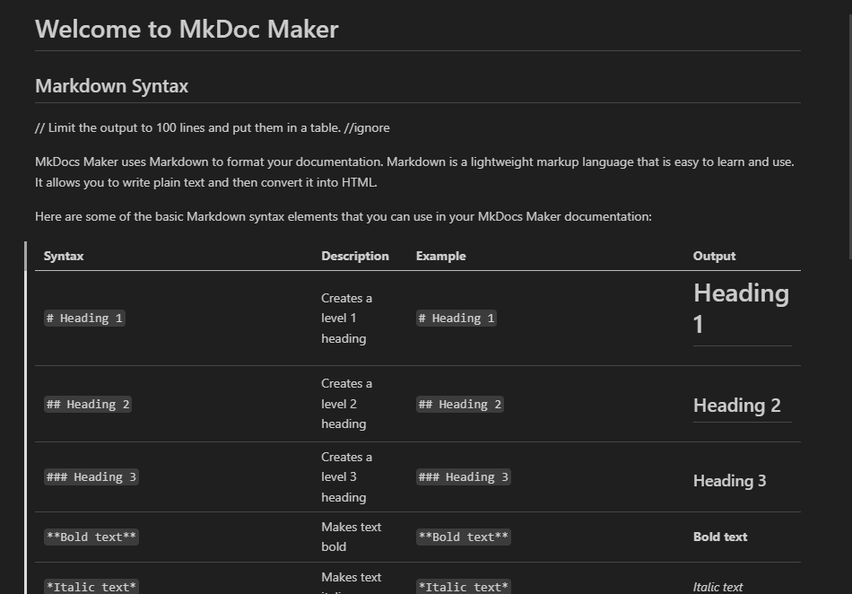
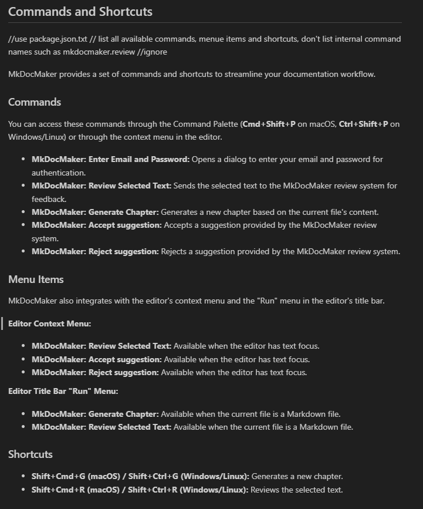
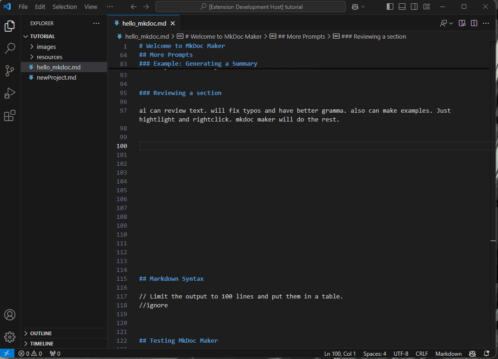
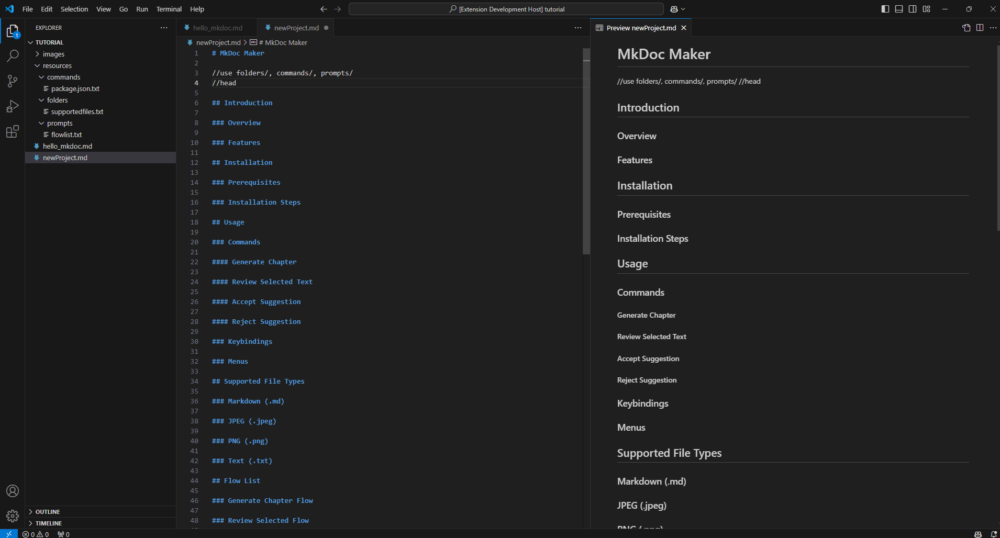

# MkDoc Maker

MkDoc Maker is an AI-powered markdown writing assistant designed to help you create high-quality technical documentation faster. It leverages the latest LLMs(large Language Models) to extract information from various sources, including technical documents, images, and even your own messy notes, and then uses this information to generate well-structured and informative content. 

**How MkDoc Maker Works:**

Think of MkDoc Maker as a writing partner. You provide it with context, and it assists you in generating content, refining existing text, even suggesting headings. While it can't write the final version for you, it can significantly speed up your workflow by providing ideas, frameworks, and suggestions to work with. 

**Key Features:**

* **Content Generation:**  Generate new chapters based on your existing notes, images, or technical documents.
* **Review and Refinement:**  Review existing text and receive suggestions for improvement, including grammar and style corrections.
* **Heading Generation:**  Struggling to come up with headings? MkDoc Maker can help you create a well-structured outline for your document.

**Remember:** MkDoc Maker is a tool to assist you, not replace you. It's essential to review and validate the generated content to ensure accuracy and alignment with your project's specific needs. 

## Getting Started

**Install Extension**

Simply install the extension from the VS Code marketplace. Search for "MkDoc Maker" and click *install*.

**Set up an Account**

You will need to create an account to use MkDoc Maker. To do this, head over to [https://mkdoc-maker.web.app/](https://mkdoc-maker.web.app/) and register. Be sure to verify your email.

**Set Email and Password for the Extension** 

Once you have installed the extension, configure it with your account credentials . To do this, open the command palette (**Ctrl+Shift+P** or **Cmd+Shift+P**) and type "MkDoc Maker: Enter Email and Password" and select the command. Enter your details and press *Enter*


You are now ready to use MkDoc Maker.

## Basic Example

- Create a new `hello_mkdoc.md` file and open it.
- Let's give it a header "# Welcome to MkDoc Maker" and one subchapter "## Markdown Syntax"
- Add the prompt "//generate" inside your subchapter
- Your file should look like this:



- press the "PLAY" button on the top right of your editor




- MkDoc Maker will take the information it has (not a lot at the moment) and feed this to an AI-model and insert the answer back into the document.
- Buttons will pop up for you to "Accept" or "Reject" the suggestion. Press "Accept".
- Hit the "preview" button in the top right hand corner to see your Markdown file in all its rendered glory.
- If you accept the generated text, then the extension will automatically change the prompt to "//ignore" so it isn't accidentally run again.


**Refining our Query**

Let's review what we have given the AI as input and what it generated. All we have entered so far is the document title and the chapter title. Not a lot really. The "//generate" command tells it to generate content for this chapter. This allows you to work chapter by chapter and tweak each as you go.

Given that the header for this chapter is "Markdown Syntax", th AI model returned a summary of how to write markdown. If you are new to markdown, have a read and play with it. Also make sure to toggle the preview on, so you can see how a rendered document looks.

Apart from the standard markdown syntax, on my run, it also combined information from the "MkDocs" project (https://www.mkdocs.org/). Which is a great way to generate static sites based on markdown pages. More on that later. Obviously this is just a "guess" from the AI-model and not correct in this instance.

Let's say we want to give the AI some more directives and limit the output to 100 lines and put it in a table. 

First hit Ctrl + Z until you to your original document and then add a **note** starting with "// " (note the space!):

  ```markdown
  # Welcome to MkDoc Maker

  ## Markdown Syntax

  // Limit the output to 100 lines and put in a table.
  //generate

  ```

Now the output will look something like this:




## Providing more Input for the Model

So far we have given the LLM (Large language model) very little information about our project and what we would like it to write about. Given that your project has most likely not been included in the learning data for the model, you can't use the models "knowledge" for generating your documentation. That said, like with Markdown syntax, you can easily create references to well known technologies if your project uses them.

You can include more information for your prompt through various ways:

- It will always consider the Document and Chapter Titles as well as the rest of the document written so far
- You can add notes as directives
- you can embed images and other resources.

Let's add this screen shot of VS Code when setting up the Extension and ask it to write a chapter. You may have noticed that MkDoc Maker has automatically created 2 folders next to your markdown document - `images` and `resources`. The `images` folder is used for screengrabs that you want to include in your document, like the ones here in the README.md guide. `resources` can contain multiple subfolders with images or text files that are useful references to consider when creating the output, but are not shown to the reader of the document.

**Images**

- save this image to into your `images` folder:
  

- Then insert a reference to it in your markdown file like this:
    ```markdown
    # Welcome to MkDoc Maker
    
    ## Create an account
    
    
    
    //generate
    
    
    ## Markdown Syntax
    
    // Limit the output to 100 lines and put them in a table.
    //ignore
    ```

- (note to change the command in the markdown syntax chapter to "//ignore" as we don't want to run this)
- If you now run the extension, it will analyse the image and consider it in its response.
- You can also add "// notes" to refine the response, or sometimes it is just simple to edit the response until you are happy.


> INFO
>
> Large Language Models (LLMs) are amazing at what they do, but under the hood they are a very fancy next word predicting machine. They appear to be "intelligent", however only you as the writer will know your project, so you need to validate the output generated.
>
> In the above example, the AI assumed that the extension is available via the VS Code Extension Marketplace. As we are in Alpha, this is not the case, but how should the AI know? So I deleted this, but it got how to install manually via the .vsix file correctly.

 

### Resources

In addition to images that the user will see as part of the document, we can add more images and also larger text files as references for the AI to consider.

For a VS Code extension, all commands, shortcuts and menu items are defined in a file called `package.json`. Currently the extension only supports images and text files, so adding a `.txt` to the end of the file makes it compatible and I can copy it to the resources folder.

I can now include this file using the `//use <filename>` command:

  ```markdown

  ## Commands and Shortcuts

  //use package.json.txt
  // list all available commands, menue items and shortcuts, don't list internal command names such as mkdocmaker.review
  //generate

  ```


And this is the output:




Awesome - this just saved me a lot of time and with some minor tweaks this is now in this README file.

> NOTE
>
> On my first run it would list the internal command references, so I had to tweak the // note to exclude them, hence "...don't list internal command names such as mkdocmaker.review". Generally, if you can be specific in your prompts and give examples, it will help the LLM to respond as you would expect. Well, just like a writer, who doesn't really know what "command names" are, you would give an example to be sure.


### Folders

At times you may include multiple files or images as resources. You can add multiple files as comma separated values, however you can also create subfolders and then reference all files in that folder. Often it makes sense to organise your resources in folders as chapters, so you can add resources for each one.

This is an example syntax after moving the file `package.json.txt` into a folder called `commands` (note the "/" after the folder name):

  ```markdown

  ## Commands and Shortcuts

  //use commands/
  // list all available commands, menue items and shortcuts, don't list internal command names such as mkdocmaker.review
  //generate

  ```


### Supported file formats


We are continually adding more formats that can be used as resources. At the time of writing the following formats are supported:

| Format                    | Example     | Description                                                  |
| ------------------------- | ----------- | ------------------------------------------------------------ |
| Text files (.txt)         | myFile.txt  | Can ingest any plain text file. As ingestion works on the file ending you can add .txt to any code related file and include it. |
| Images (.png, .jpg, jpeg) | myImage.png | Images can be screengrabs or any other useful resource.      |
| Markdown (.md)            | myDoc.md    | A markdown file, i.e. technical documentation of some other technology. |
| PDF (.pdf)                | myDoc.pdf   | Any pdf file as resource or reference |
| Video (.mp4)              | myVideo.mp4 | Any mp4 video file as resource or reference |
| Audio (.m4a, .mp3)        | myAudio.m4a | Any m4a or mp3 audio file as resource or reference | 


## More Prompts

MkDoc Maker offers a variety of prompts to help you generate different types of content. Here's a breakdown of the available prompts:

| Prompt | Description |
|---|---|
| `generate`, `gen`, `generateChapter` | Generates a new chapter based on the provided context. |
| `rev`, `review` | Reviews the selected chapter and provides suggestions for improvement. |
| `sum`, `summary` | Generates a summary of the selected chapter and sub-chapters. |
| `head`, `headings` | Generates headings for the selected chapter. |
| `test`, `testplan` | Generates a test plan for the complete document. |

### Generating a Summary

  Let's say you want to add an overview or summary to a document. You can use the `//sum` or `//summary` prompt. It will use any selected text so you can control what part of the document you want to summaries. If no text is selected it will use the current chapter where the command is located and include all sub-chapters.

Here and example:

  **Input:**

    ```markdown
    # Welcome to MkDoc Maker
    
    //summary
    
    ## Installing the Extension
    
    ...

  ```

  **Output:**

    ```markdown
    # Welcome to MkDoc Maker
    
    //ignore
    
    MkDoc Maker is a powerful extension for Visual Studio Code that helps you create high-quality documentation from Markdown files. It provides a range of features to streamline your documentation workflow, including prompts for generating different types of content, a review system for improving your writing, and shortcuts for common tasks. 
    
    
  ```


 In this instance, nothing was selected so it will use all sub-chapters which in this case is the whole document as "# Welcome to MkDoc Maker" is the root or top-level chapter.


### Reviewing a Section

You can ask MkDoc Maker to make a suggestion to improve a part of text. You can use 2 ways to trigger this feature:

- as with other commands you can use "//review" to review a whole  chapter.
- Alternatively you can select a section and right-click to use Review from the context menu.

Here is an example how you could use the review prompt:

```
ai can review text. will fix typos and have better gramma. also can make examples. Just hightlight and rightclick. mkdoc maker will do the rest.
```

Will change to:

```
MkDoc Maker can help you review your text. It can fix typos, improve grammar, and even generate examples. To use this feature, simply highlight the text you want to review and right-click. MkDoc Maker will handle the rest. 
```




### Creating Headings

When starting out on a documentation project, it can be difficult to divide your project into chunks that can serve as headings. The "//headings" or "//head" prompt can help in this situation and generate a structure. It is almost always easier to modify a suggestion rather than write something from scratch.

Here an example:

  ``` markdown

  # MkDoc Maker

  //use folders/, commands/, prompts/
  //head

  ```

As before you can include any resources in your prompt, so if you already have some images or other files, include them to give more context. After a run it will generate a headings structure suggestion:



### Generating a testplan (experimental)

The latest edition to MkDoc Maker is a prompt that helps with the creation of test documentation. 

In your `hello_mkdoc.md` document create a new chapter at the end of the document:

  ```markdown
  ## Testing MkDoc Maker

  // generate a list of testcases covering all functions and features.
  //test
  ```

Based on the entire document it will create test case headers. 


## Workflow and shortcuts

MkDoc Maker is there to help you write documentation faster. Its strength is in automating repeating tasks and integrating AI output directly into your workflow, so you don't have to switch away from the document you are creating.

### VS Code Commands

You can access these commands through the Command Palette (**Cmd+Shift+P** on macOS, **Ctrl+Shift+P** on Windows/Linux) or through the context menu in the editor.

* **MkDocMaker: Enter Email and Password:**  Opens a dialog to enter your email and password for authentication.
* **MkDocMaker: Review Selected Text:** Sends the selected text to the MkDocMaker review system for feedback.
* **MkDocMaker: Generate Chapter:** Generates a new chapter based on the header, notes, resources and the remaining current file's content.
* **MkDocMaker: Accept suggestion:** Accepts a suggestion provided by the MkDocMaker review system.
* **MkDocMaker: Reject suggestion:** Rejects a suggestion provided by the MkDocMaker review system.
* **MkDocMaker: Create a demo Markdown document:** Creates a sample markdown document that can be used for first experiments.

### Menu Items

MkDocMaker also integrates with the editor's context menu and the "Run" menu in the editor's title bar.

**Editor Context Menu:** Available through RIght-click on the text editor

* **MkDocMaker: Review Selected Text:**  Will review the selected text.
* **MkDocMaker: Accept suggestion:** Accepts the highlighted text suggestion.
* **MkDocMaker: Reject suggestion:** Rejects the highlighted text suggestion.

**Editor Title Bar "Run" Menu:**

* **MkDocMaker: Generate Chapter:** Available when the current file is a Markdown file.
* **MkDocMaker: Review Selected Text:** Available when the current file is a Markdown file.

### Shortcuts

* **Ctrl+M, Ctrl+M:**  Runs the chapter parser and executes commands.
* **Ctrl+M, Ctrl+R:**  Reviews the selected text. 
* **Ctrl+M, Ctrl+Y: Accept the text generation. ("**Y**es")
* **Ctrl+M, Ctrl+N**: Reject the text generation ("**N**o")


## Version History
0.2.0
- pack with esbuild
- release to marketplace as pre-release

0.1.6
- refactor extension
- readme and demo updates
- review text insertion improved
- Settings: file cache, model, whole doc and temperature added
- better query reporting
- improved logging
- fix headings autocomplete

0.1.5
- support for images and resources as URLs, especially useful for images
- demo command to generate a sample Markdown document
- basic auto-complete when typing //
- add version history to README

0.1.4
- remove password validation in VS Code

0.1.3
- package tidy up

0.1.2
- add support for pdf, mp4, mp3, m4a
- fix space in file name bug
- last login time recorded
- finish unit tests

0.1.1
- fix insertions bugs
- README.md
- added logger

0.1.0
- first basic version
